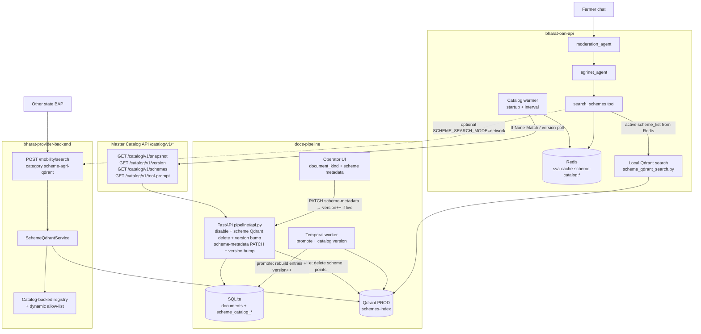
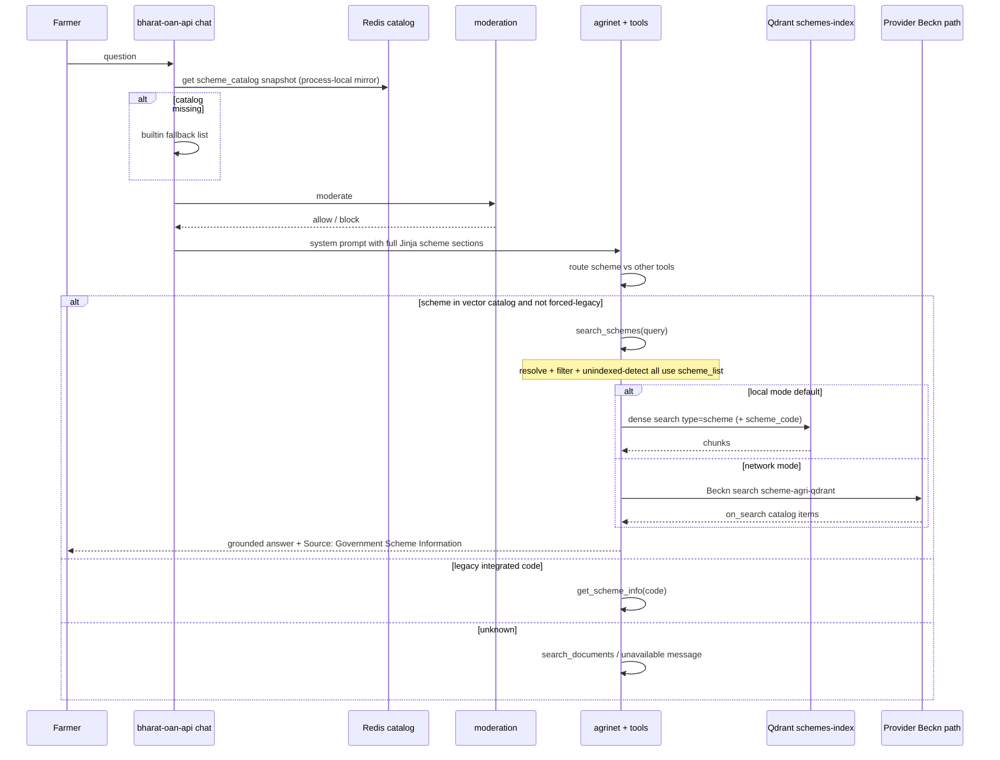
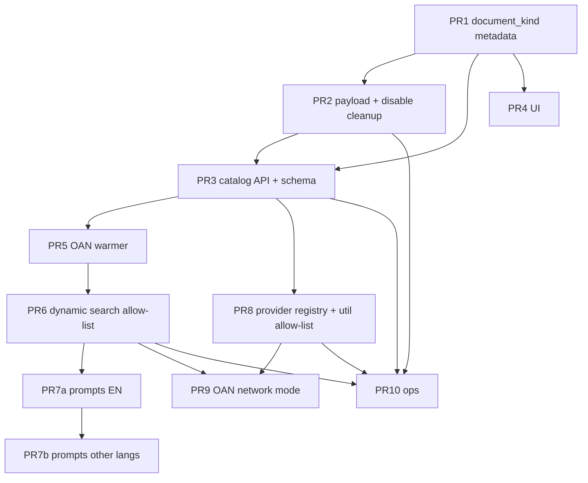

# Design: Master Scheme Catalog API + AI Layer Sync + Beckn Network Scheme Search

| Field | Value |
|---|---|
| **Title** | Master Scheme Catalog & Dynamic AI Tooling for Bharat Vistaar |
| **Author** | Platform / Vistaar engineering |
| **Date** | 2026-07-29 |
| **Status** | Draft (revised post-review) |
| **Workspace** | `/Users/akshatrana/Documents/GITHUB/vistaar/bharatvistaar` |
| **Primary systems** | `docs-pipeline/`, `bharat-oan-api/`, `bharat-provider-backend/` |

---

## Overview

Today, scheme coverage for the farmer chat agent is **hard-coded in four places** that must be redeployed whenever a new guideline PDF is promoted to PROD (or aliases change):

1. `bharat-oan-api/helpers/scheme_qdrant_search.py` — `_QDRANT_SCHEME_DEFINITIONS` (14 codes including `nbm`; codes, names, aliases, filter allow-list)
2. `bharat-oan-api/agents/tools/scheme_info.py` — `_SCHEME_LABELS` (legacy Hasura/Beckn schemes)
3. `bharat-oan-api/assets/prompts/agrinet_*.md` — static lists of the “13 vector-indexed” and “16 integrated” schemes (plus tools table, routing paragraphs, “available schemes” merge)
4. `bharat-provider-backend/src/services/scheme-qdrant/scheme-registry.ts` — TypeScript port of the same hard-coded vector list for the network path

**Proposed solution:** make **docs-pipeline** the system of record for which scheme documents are **live in PROD**, expose a **Master Catalog API** under `/catalog/v1/*` (schemes + tool prompt fragments + collection metadata + monotonic version), and have **bharat-oan-api** and **bharat-provider-backend** refresh Redis/in-memory snapshots on a scheduler. At chat time the agent reads the catalog (no hard-coded vector scheme list), runs moderation as today, and calls scheme search only when the catalog covers the scheme. For multi-state / network exposure, **bharat-provider-backend** already implements Beckn `search` → `on_search` for category `scheme-agri-qdrant`; this design completes that path with catalog-driven registry (including dynamic allow-lists on **both** OAN and provider filter paths).

**Zero-redeploy scope (explicit):**

| Scheme class | Zero-redeploy after go-live? | Mechanism |
|---|---|---|
| **Vector-indexed** (`search_schemes` / Qdrant) | **Yes** | Catalog + vectors + prompt Jinja |
| **Legacy integrated** (`get_scheme_info` / Hasura) | **No** | Still requires OAN `Literal[...]` + seed config deploy |

---

## Background & Motivation

### Current state

**Docs pipeline** (`docs-pipeline/`) is a review-driven OCR → translate → chunk → DEV ingest → Super Admin PROD promote system. Key facts from `docs-pipeline/docs/SYSTEM_DESIGN.md` and code:

| Concern | Implementation |
|---|---|
| Tenancy | `documents.instance` (state code), JWT groups `/states/{ST}/role` |
| Stages | `registered` → … → `ready_for_ingestion` → `ingesting` → `approval_for_prod` → `ingesting_prod` → `completed` |
| DEV index | Qdrant DEV via `ingest_document_from_db` |
| PROD index | `promote_document_to_prod_qdrant` → `PROD_VECTOR_DB_URL` / `PROD_VECTOR_DB_COLLECTION_NAME` (default **`documents-index`**) |
| Payload shape | `_prepare_records` in `pipeline/activities.py` sets `type: "document"`, `instance`, domain tags — **no `scheme_code` / `scheme_name` / `type: "scheme"`** |
| Disable | `DELETE /documents/{id}` soft-disables SQLite and optionally deletes from **the DEV index only** — **not PROD Qdrant** |

**Important:** Live vector schemes already work today via OAN/provider against a separate **`schemes-index`** collection with `type=scheme` payloads. Those vectors were **not** produced by the current docs-pipeline promote path. Migration is therefore a first-class workstream (see **Appendix A**), not only a catalog bootstrap.

**AI layer** (`bharat-oan-api/`) chat flow (`app/services/chat.py`):

1. Moderation agent (`agents/moderation.py`)
2. Agrinet agent (`agents/agrinet.py`) with tools from `agents/tools/__init__.py`
3. For vector schemes: `search_schemes` tool (`agents/tools/search.py`) → local `helpers/scheme_qdrant_search.search_schemes` against `QDRANT_COLLECTION_NAME` (default `schemes-index`)
4. For legacy structured schemes: `get_scheme_info` → Beckn BAP `POST {BAP_ENDPOINT}/search` with domain `schemes:vistaar`, category `schemes-agri`

Redis is already wired (`app/core/cache.py` — aiocache + Redis, prefix `sva-cache-`, default TTL 24h) and used by NPSS, SATHI, SHC file cache, session utils, health checks. Startup already warms the E5 embedder (`main.py` → `warm_scheme_search`).

**`FarmerContext`** (`agents/deps.py`) has **no state/instance field** — only query, lang, session, geo, NPSS fields. Chat search has no instance filter today.

**Provider / network** (`bharat-provider-backend/`):

- `/mobility/search` routes category `scheme-agri-qdrant` to `SchemeQdrantService.search` (`src/app.controller.ts`)
- Response builder `buildSchemeQdrantOnSearch` already matches the target Beckn contract
- Registry is a **TypeScript port** of the hard-coded Python list (`scheme-registry.ts`)
- `filterResultsByScheme` / `isKnownSchemeCode` in `scheme-query.util.ts` use global `QDRANT_SCHEME_CODES` — same allow-list bug as OAN

### Pain points

| Pain | Impact |
|---|---|
| New scheme requires code change in ≥3 repos/files + prompt rewrites in 10 languages | Slow time-to-live; OAN / provider / prompt drift |
| Alias/name edits require redeploy even when vectors already exist | Content ops blocked |
| Docs-pipeline PROD promote does not publish catalog metadata or scheme payloads | AI cannot discover new pipeline schemes |
| Payload schema mismatch (`type=document` vs `type=scheme` + `scheme_code`) | Pipeline-ingested schemes invisible to scheme search filters |
| Dual hard-coded registries (Python + TS) | Network and chat can disagree on coverage |
| Disable does not remove PROD scheme vectors | Residual hits after soft-delete |

### Related systems (out of primary scope but relevant)

- **oan-data-ingestion** — Hasura/structured scheme content (legacy `schemes-agri`); remains source for `get_scheme_info`
- **vistaar-platform** — operator UI mockups; not runtime path for vectors
- **bh-vistaar-document-site** — Type-B onboarding docs; network exposure story

---

## Goals & Non-Goals

### Goals

1. **Single source of truth** for “which vector-indexed schemes are live for AI tools/prompts” — Master Catalog API owned by docs-pipeline (PROD-promoted schemes + curated metadata).
2. **Zero-redeploy onboarding for vector schemes:** new scheme → metadata + promote PROD → catalog version bumps → Redis/provider refresh → tool resolution + **full multi-language prompts** pick it up within a defined SLA (see **Definition of Done**).
3. **Zero-redeploy alias/name/visibility edits** on already-live schemes via metadata PATCH + catalog version bump (vectors reindex only when payload fields must change).
4. **Preserve existing chat quality** — intent classification, section focus, rerank, supplemental search stay; only the **scheme list / allow-list source** becomes dynamic (OAN **and** provider).
5. **Beckn-compliant network exposure** so other states can call scheme document search (`domain: schemes:vistaar`, action `search`/`on_search`, category `scheme-agri-qdrant`).
6. **Multi-tenant fields + concrete nationwide default for v1** (see Key Decision 11 / Multi-state policy).
7. **Safe disable:** soft-disable of a scheme document with `remove_from_search=true` deletes PROD (and DEV) scheme vectors, rebuilds catalog, bumps version.
8. **Incremental rollout** — feature flags, fallback to built-in list, independently mergeable PRs, E2E gate before prod flag-on.

### Non-Goals

- Replacing Hasura/legacy `get_scheme_info` / `schemes-agri` path content system.
- Making **legacy** scheme codes zero-redeploy (still need OAN `Literal[...]` + seed deploy — see dual-list ownership).
- Rewriting the Temporal pipeline stage machine or large operator UI redesign beyond scheme-metadata fields and disable cleanup.
- Real-time per-request fan-out to docs-pipeline on every farmer chat.
- Automatic LLM generation of aliases without human review.
- Full Beckn protocol stack redesign (signing, async callbacks) — use existing provider `/mobility/search` patterns.
- Per-farmer state-scoped scheme filtering in chat for v1 (no `FarmerContext.instance` yet).

---

## Proposed Design

### High-level architecture



### End-to-end request flow (farmer question)



---

### 1. Scheme identity model (docs-pipeline)

#### Problem

`_prepare_records` does not emit the payload fields that `search_schemes` expects:

```text
# Expected by scheme_qdrant_search._hit_to_result / _run_scheme_search
type, scheme_code, scheme_name, scheme_aliases?, doc_id, chunk_id, text
Filter: type == "scheme" AND optional scheme_code
```

Docs-pipeline currently emits `type: "document"` without scheme fields. Default PROD collection is `documents-index`, not `schemes-index`.

#### Naming: `document_kind` (not `content_type`)

`chunks.content_type` already exists (chunk semantics: `body` / heading / etc. in `pipeline/models.py`, `db.py`). Upload MIME is also called `content_type` in `api.py`.  

**Use `document_kind` on `documents`:**

| Value | Meaning |
|---|---|
| `document` | Default; general knowledge PDF → documents-index path |
| `scheme` | Government scheme guideline → schemes-index + catalog |

Keep `chunks.content_type` unchanged. Document the distinction in `docs-pipeline/docs/SYSTEM_DESIGN.md`.

#### Data model changes (SQLite)

Migration via existing `_add_column_if_missing` pattern in `pipeline/db.py`:

**`documents` extensions**

| Column | Type | Notes |
|---|---|---|
| `document_kind` | TEXT | `document` (default) \| `scheme` |
| `scheme_code` | TEXT | slug e.g. `pm-ddky`, `cdp`; unique among live PROD schemes |
| `scheme_name` | TEXT | display name |
| `scheme_aliases_json` | TEXT | JSON array of strings |
| `tool_routing` | TEXT | `qdrant` \| `legacy` \| `both` (default `qdrant` when kind=scheme) |
| `catalog_visible` | INTEGER | 1 if eligible for Master Catalog when stage=completed |
| `network_visible` | INTEGER | 1 if exposed on Beckn network; **default at create/PATCH** from `CENTRAL_INSTANCES` rule (see Multi-state policy) |

**New table `scheme_catalog_meta`**

| Column | Type | Notes |
|---|---|---|
| `id` | INTEGER PK | singleton row id=1 |
| `version` | INTEGER | monotonic; see **Catalog invalidation rules** |
| `updated_at` | TEXT | ISO |
| `notes` | TEXT | optional |

**Table `scheme_catalog_entries`** (aggregated by `scheme_code`):

| Column | Type | Notes |
|---|---|---|
| `scheme_code` | TEXT PK | |
| `scheme_name` | TEXT | |
| `scheme_aliases_json` | TEXT | merged aliases |
| `instances_json` | TEXT | list of instances with live docs |
| `workflow_ids_json` | TEXT | contributing PROD docs |
| `collection_name` | TEXT | PROD scheme collection |
| `chunk_count` | INTEGER | sum |
| `status` | TEXT | `live` \| `pending_prod` \| `pending_reindex` \| `disabled` |
| `network_visible` | INTEGER | **OR** of contributing live docs: entry is network-visible if **any** live doc has `network_visible=1` |
| `promoted_at` | TEXT | latest |
| `content_hash` | TEXT | hash of code+name+aliases+visibility for ETag helpers |
| `source` | TEXT | `pipeline` \| `bootstrap` \| `import` |

**Catalog membership rule (live / in `vector_schemes` snapshot)**

A scheme is included in live `vector_schemes` when its catalog entry has:

- `status = 'live'`
- and at least one contributing document with `document_kind = 'scheme'`, non-empty `scheme_code`, `stage = 'completed'`, `is_disabled = 0`, `catalog_visible = 1`

**Exclude** entries with `status = 'pending_reindex'` (or `pending_prod` / `disabled`) from live `vector_schemes` so consumers never resolve a code that Qdrant cannot yet serve.

Multiple documents may share one `scheme_code`; catalog **aggregates** by `scheme_code`.

**`network_visible` aggregation (rebuild):**  
`entry.network_visible = 1` if **any** contributing live document has `network_visible=1` (**OR** / max-visibility). Operators can expose a multi-doc scheme by marking any one live doc network-visible.

#### Catalog invalidation rules (critical)

Any change that affects **live membership or presentation** must:

1. Rebuild/update `scheme_catalog_entries` for the affected `scheme_code`(s)
2. `UPDATE scheme_catalog_meta SET version = version + 1, updated_at = now`

| Event | Version bump? | Vectors action | Catalog entry |
|---|---|---|---|
| Successful promote of scheme doc to PROD | **Yes** | Upsert points to `schemes-index` | `status=live` (clears `pending_reindex` if reindex completed) |
| `PATCH` name/aliases/`catalog_visible`/`network_visible`/`tool_routing` (no code change) on completed doc | **Yes** | **Catalog-only** | Stay `live` if still eligible |
| **`scheme_code` rename** on completed live doc | **Yes** | Do **not** publish new code as live until reindex | **Rule (b):** set entry `status=pending_reindex`; **exclude from live `vector_schemes`**; drop old-code live entry (or mark old code disabled if no other docs). UI: “Requires reindex.” After successful reindex/promote under new code → `status=live`, version++ again |
| `catalog_visible` flipped false on last live doc | **Yes** | optional leave + allow-list hide, or delete if `remove_from_search` | Entry → `disabled` |
| Disable document with `remove_from_search=true` | **Yes** | **Delete** points by `doc_id`/`workflow_id` from PROD scheme collection (+ DEV if present) | Rebuild; `disabled` if no live docs |
| Disable with `remove_from_search=false` | **Yes** | Catalog only (not recommended for schemes) | Rebuild |
| Last live doc for `scheme_code` removed/disabled | **Yes** | delete remaining points for that code if no live docs | `status=disabled` |
| Admin `POST /catalog/v1/rebuild` | **Yes** | Recompute from documents; no vector rewrite | Re-derive status |
| Bootstrap seed / import script | **Yes** | Catalog rows only unless import includes reindex | `live` if bootstrap intends searchable |

**`scheme_code` rename — chosen rule (b) `pending_reindex`:**

```text
On PATCH that changes scheme_code on a completed, previously live scheme document:
  1. Update document.scheme_code = new_code
  2. Rebuild: new_code entry → status=pending_reindex (NOT in vector_schemes)
  3. Old code: if no other live docs remain → status=disabled (or remove from live list)
  4. bump_catalog_version("scheme_code_rename_pending_reindex")
  5. Operator runs reingest/promote (payload uses new scheme_code)
  6. On promote success: entry status=live, bump_catalog_version("scheme_code_reindex_complete")
```

This avoids consumers resolving the new code while Qdrant still has the old `scheme_code` payload (empty hits / false `scheme_unavailable` under a “live” name).

**Catalog-only vs reindex decision:**

| Edit | Catalog-only OK? | Why |
|---|---|---|
| `scheme_name`, aliases, `catalog_visible`, `network_visible` | Yes | Resolution/prompt/network tags come from catalog; Qdrant `scheme_name` in payload is display-only for hits |
| `scheme_code` change | No — **`pending_reindex` until reindex** | Qdrant filter + payload must match; hide from live list until promote succeeds |
| Chunk text change | No | Existing reingest / promote path |

Implementation helper (docs-pipeline):

```python
def bump_catalog_version(conn, reason: str) -> int:
    # UPDATE scheme_catalog_meta SET version = version + 1, updated_at = ?, notes = ?
    # return new version
```

Call from: promote activity, disable path, scheme-metadata PATCH, rebuild endpoint.

#### Operator UX (minimal)

On upload / document detail:

- Toggle **Document kind: Scheme**
- Fields: scheme_code (required if scheme), scheme_name, aliases (chips), network_visible, catalog_visible
- Validation: `scheme_code` lowercase slug `^[a-z0-9]+(?:-[a-z0-9]+)*$`
- On code rename of completed doc: UI warning “Requires reindex”; catalog sets `pending_reindex` (scheme temporarily absent from live `vector_schemes` until promote)

API:

```http
PATCH /documents/{workflow_id}/scheme-metadata
{
  "document_kind": "scheme",
  "scheme_code": "pm-ddky",
  "scheme_name": "Prime Minister Dhan–Dhaanya Krishi Yojana",
  "scheme_aliases": ["PM-DDKY", "dhan dhaanya"],
  "tool_routing": "qdrant",
  "catalog_visible": true,
  "network_visible": true
}
```

Permission: same as document edit (`review` / `pipeline`); Super Admin may edit any instance.  
Handler: validate → update columns → rebuild entry/entries → version bump. If `scheme_code` changed on a completed scheme doc, apply **pending_reindex** rule (above), not immediate `live` under the new code.

---

### 2. Ingest / PROD payload alignment

#### Concrete data plumbing

Today `promote_document_to_prod_qdrant` only passes `instance` from `db.get_document` into `_prepare_records`. Extend as follows.

**Signature (conceptual):**

```python
def _prepare_records(
    document_id: str,
    filename: str,
    chunks: list[dict],
    workflow_id: str | None = None,
    name_gu: str | None = None,
    name_en: str | None = None,
    description: str | None = None,
    include_e5_prefix_field: bool = True,
    instance: str | None = None,
    # NEW — always load from document row at call sites:
    document_kind: str = "document",
    scheme_code: str | None = None,
    scheme_name: str | None = None,
    scheme_aliases: list[str] | None = None,
) -> list[dict]:
    ...
```

**Call sites** (`ingest_document_from_db`, `promote_document_to_prod_qdrant`, reingest):

```python
doc = db.get_document(workflow_id) or {}
aliases = json.loads(doc.get("scheme_aliases_json") or "[]")
records = _prepare_records(
    document_id,
    filename,
    chunks,
    workflow_id=workflow_id,
    instance=doc.get("instance"),
    document_kind=(doc.get("document_kind") or "document"),
    scheme_code=doc.get("scheme_code"),
    scheme_name=doc.get("scheme_name"),
    scheme_aliases=aliases if isinstance(aliases, list) else [],
)
```

**Per-record payload when `document_kind == "scheme"` and `scheme_code` set:**

| Field | Type | Value |
|---|---|---|
| `type` | string | `"scheme"` |
| `scheme_code` | string | document metadata |
| `scheme_name` | string | document metadata |
| `scheme_aliases` | **array of strings** | document metadata (JSON array in Qdrant payload; matches OAN resolve candidates) |
| `text` | string | chunk text |
| `doc_id` | string | `document_id` |
| `chunk_id` | string | same as `_id` (md5 hex used as point payload id key) |
| `chunk_index` | int | `chunk_num` |
| `chunk_num` | int | existing |
| `workflow_id` | string | existing |
| `instance` | string | existing |
| `section` | string | existing inference |
| `source` | string | `"docs-pipeline"` |
| plus existing title/domain fields | | keep for provenance |

When `document_kind != "scheme"`: keep `type: "document"` (current path); **do not** set scheme fields.

**`PAYLOAD_FIELDS` in `pipeline/vector_store/qdrant_store.py`** — add:

```python
"scheme_code",
"scheme_name",
"scheme_aliases",
"chunk_id",
"chunk_index",
```

OAN `_hit_to_result` already reads `payload.scheme_code`, `scheme_name`, `text`, `doc_id`, `chunk_id`. Provider maps the same.

**Point IDs:** continue `point_id_for_record` over `_id`. For migration of legacy index, see Appendix A (deterministic IDs from same `doc_id`+`chunk_num` formula when re-ingesting).

#### Collection routing

| `document_kind` | DEV target | PROD target |
|---|---|---|
| `document` | existing Qdrant documents-index | `PROD_VECTOR_DB_COLLECTION_NAME` (default `documents-index`) |
| `scheme` | optional DEV schemes collection | **`PROD_SCHEME_VECTOR_DB_COLLECTION_NAME`** default `schemes-index` |

Env (docs-pipeline):

```text
PROD_SCHEME_VECTOR_DB_URL                 # default: PROD_VECTOR_DB_URL
PROD_SCHEME_VECTOR_DB_API_KEY             # default: PROD_VECTOR_DB_API_KEY
PROD_SCHEME_VECTOR_DB_COLLECTION_NAME=schemes-index
```

**Guard:** if `document_kind=scheme`, promote **must not** write to the documents-index collection. Fail the activity with a clear error if scheme collection env is missing.

#### Disable / remove from search (critical)

Extend `DELETE /documents/{workflow_id}` (`disable_document` in `pipeline/api.py`):

When `remove_from_search=true` (default):

1. Existing DEV-index delete for document-kind paths
2. **NEW:** if `document_kind == scheme` (or points exist in scheme collection for this `doc_id`/`workflow_id`):
   - Delete points from `PROD_SCHEME_VECTOR_DB_COLLECTION_NAME` filtered by `doc_id` or `workflow_id`
   - Optionally delete from DEV scheme collection if configured
3. Rebuild `scheme_catalog_entries` for that `scheme_code`
4. If no remaining live docs for code → `status=disabled`
5. `bump_catalog_version("disable_scheme_document")`
6. Audit metadata: `scheme_qdrant_deleted`, `scheme_code`, `catalog_version`

Restore (`POST .../restore`) remains SQLite-only (existing behavior); restoring a scheme **requires explicit reingest/promote** to repopulate vectors — document in UI.

**Integration test (acceptance):** promote scheme PDF → search hits → disable with `remove_from_search=true` → catalog version +1, entry disabled or gone → OAN/provider search returns no hits / `scheme_unavailable` for that code.

#### On successful promote of scheme document

1. Upsert vectors to schemes-index  
2. Rebuild/update `scheme_catalog_entries` (`source=pipeline`)  
3. `bump_catalog_version("promote_scheme")`

**Embedding model:** keep `intfloat/multilingual-e5-large` with `passage:` / `query:` prefixes.

---

### 3. Master Catalog API (docs-pipeline)

Hosted on the existing FastAPI app (`pipeline/api.py`). All catalog routes under **`/catalog/v1/`** only.

#### Endpoints

| Method | Path | Purpose | Auth |
|---|---|---|---|
| `GET` | `/catalog/v1/schemes` | List live schemes (filterable) | service key **or** admin JWT |
| `GET` | `/catalog/v1/snapshot` | Full snapshot for cache warmers | service key **or** admin JWT |
| `GET` | `/catalog/v1/version` | Cheap poll: `{ version, updated_at }` | service key **or** admin JWT |
| `GET` | `/catalog/v1/tool-prompt` | Prompt fragment(s) | service key **or** admin JWT |
| `POST` | `/catalog/v1/rebuild` | Admin: recompute entries from documents | **admin JWT only** |

Query params:

- `instance` — optional; when set, filter entries whose `instances_json` contains that instance
- `status` — default `live`
- `include_pending` — include `approval_for_prod` for staging AI (default false)
- `network_visible` — optional bool filter for network consumers

**OAN warmer:** calls **global** snapshot (no instance filter) — v1 chat is nationwide.  
**Provider network:** may call with `network_visible=true` or filter client-side from snapshot field.

#### Snapshot response (canonical) + JSON Schema

Cross-repo contract file (land in PR3):

`docs-pipeline/schemas/catalog-snapshot.schema.json`  
(copied or vendored into OAN/provider tests)

```json
{
  "api_version": "1",
  "catalog_version": 42,
  "updated_at": "2026-07-29T10:15:00Z",
  "etag": "\"42-a1b2c3\"",
  "collections": {
    "scheme_qdrant": {
      "name": "schemes-index",
      "embedding_model": "intfloat/multilingual-e5-large",
      "filter_type": "scheme"
    },
    "documents": {
      "name": "documents-index"
    }
  },
  "legacy_schemes": [
    {
      "scheme_code": "pmkisan",
      "scheme_name": "Pradhan Mantri Kisan Samman Nidhi scheme",
      "tool": "get_scheme_info",
      "tool_routing": "legacy"
    }
  ],
  "vector_schemes": [
    {
      "scheme_code": "pm-ddky",
      "scheme_name": "Prime Minister Dhan–Dhaanya Krishi Yojana",
      "scheme_aliases": ["PM-DDKY", "dhan dhaanya"],
      "tool": "search_schemes",
      "tool_routing": "qdrant",
      "instances": ["default"],
      "network_visible": true,
      "chunk_count": 128,
      "workflow_ids": ["..."],
      "promoted_at": "2026-07-20T12:00:00Z",
      "source": "pipeline"
    }
  ],
  "tool_prompts": {
    "search_schemes_doc": "Available Qdrant scheme codes: ...",
    "vector_schemes_bullets_en": "- **Micro Irrigation Fund** (mif)\n...",
    "legacy_schemes_codes_line": "\"kcc\", \"pmkisan\", ...",
    "available_schemes_flat_en": "- Micro Irrigation Fund (MIF)\n- ...",
    "vector_identifiers_block_en": "- `mif` / micro irrigation fund\n..."
  },
  "routing_exceptions": {
    "pkvy": "search_schemes",
    "nbm": "get_scheme_info"
  }
}
```

**Bootstrap clarity (counts):**

| Set | Count / membership | Notes |
|---|---|---|
| Prompt “vector-indexed” searchable | **13 codes** | mif, pkvy, pm-kmy, pulses-mission, cdp, cotton-mission, pm-ddky, midh, e-nam, pm-rkvy, nmeo, rwbcis, makhana |
| Python `_QDRANT_SCHEME_DEFINITIONS` | **14** | above + **`nbm`** |
| Bootstrap `vector_schemes` | **13 only** | **Exclude `nbm`** from vector_schemes; `nbm` is **legacy-only** via `get_scheme_info` + `routing_exceptions` |
| Legacy integrated | **16** | from `_SCHEME_LABELS` seed JSON |

#### Service-to-service auth (v1 — concrete)

Docs-pipeline today is Keycloak JWT only (`pipeline/auth/*`). There is **no** existing service-key pattern. v1 introduces one simple mechanism; **mTLS is out of scope for v1**.

| Mechanism | Use |
|---|---|
| **Service API key** (primary for OAN + provider warmers) | Header `X-Catalog-Service-Key: <key>` |
| **Admin JWT** (existing Keycloak) | Human ops + `POST /catalog/v1/rebuild` |

**Env (docs-pipeline):**

```text
CATALOG_AUTH_ENABLED=true
# Comma-separated keys; empty list + CATALOG_AUTH_ENABLED=true → deny all service access
CATALOG_SERVICE_API_KEYS=key1,key2
# Optional: allow unauthenticated catalog GETs only when ENVIRONMENT=local|dev and flag set
CATALOG_ALLOW_ANON_IN_DEV=false
```

**Implementation notes:**

- Constant-time compare against the key set (`hmac.compare_digest` in a loop / `secrets.compare_digest`)
- Deny-by-default when `CATALOG_AUTH_ENABLED=true`
- Rate limit catalog routes (slowapi already used in `api.py`) — e.g. 60/min per IP for version, 10/min for snapshot
- Audit log every `rebuild` with actor
- **Deployment:** bind catalog routes only on internal network / private hostname (not public internet). Nginx allowlist for OAN/provider CIDRs when possible
- Client env: `SCHEME_CATALOG_URL`, `SCHEME_CATALOG_SERVICE_KEY` (single key from the list)

**Not in v1:** mTLS, service JWT/OIDC client credentials (document as future hardening).

#### Caching headers

```http
ETag: "42-a1b2c3"
Cache-Control: private, max-age=30
```

Warmers send `If-None-Match`; `304 Not Modified` when version unchanged.

---

### 4. AI layer (bharat-oan-api): cache + request flow

#### 4.1 Catalog client + Redis keys (namespace pattern)

New module: `bharat-oan-api/helpers/scheme_catalog.py`

Match **SATHI** pattern (`agents/tools/sathi_seed.py`): pass `namespace=` separately so `key_builder` yields `f"{prefix}{namespace}:{key}"`.

```python
SCHEME_CATALOG_NS = "scheme-catalog"

# → Redis key: sva-cache-scheme-catalog:snapshot
await cache.get("snapshot", namespace=SCHEME_CATALOG_NS)
await cache.set("snapshot", snapshot_dict, ttl=ttl, namespace=SCHEME_CATALOG_NS)

await cache.get("version", namespace=SCHEME_CATALOG_NS)
await cache.get("schemes_list", namespace=SCHEME_CATALOG_NS)
await cache.get("tool_doc", namespace=SCHEME_CATALOG_NS)
```

| Logical key | Redis (default prefix) | Value |
|---|---|---|
| `snapshot` | `sva-cache-scheme-catalog:snapshot` | full JSON snapshot |
| `version` | `sva-cache-scheme-catalog:version` | integer |
| `schemes_list` | `sva-cache-scheme-catalog:schemes_list` | compact list for resolve |
| `tool_doc` | `sva-cache-scheme-catalog:tool_doc` | string |

TTL example: 6h on keys; warmer refreshes every `SCHEME_CATALOG_REFRESH_SECONDS` (default 300).

**Multi-replica OAN:** each process runs the warmer **or** lazy-hydrates process-local mirror from Redis on miss (first request after deploy). Prefer both: lifespan starts warmer; `get_cached_catalog_sync()` if empty → trigger async refresh / read Redis in async path before agent.

Env:

```text
SCHEME_CATALOG_URL=https://docs-pipeline-internal.../catalog/v1/snapshot
SCHEME_CATALOG_SERVICE_KEY=...
SCHEME_CATALOG_REFRESH_SECONDS=300
SCHEME_CATALOG_ENABLED=true
SCHEME_SEARCH_MODE=local   # local | network | dual
BAP_SCHEME_QDRANT_CATEGORY=scheme-agri-qdrant
```

#### 4.2 Scheduler / warmer

```text
lifespan startup:
  1. warm_scheme_search()  # existing embedder
  2. refresh_scheme_catalog(force=True)
  3. start asyncio task: every SCHEME_CATALOG_REFRESH_SECONDS
       GET /catalog/v1/version (with service key)
       if version changed or ETag miss → GET snapshot → Redis + process-local
```

**Failure policy**

| Scenario | Behavior |
|---|---|
| Catalog unreachable at startup | Log error; load **builtin fallback** (13 vector codes; exclude treating nbm as vector primary) |
| Mid-flight refresh fails | Keep last-good Redis + process-local |
| Redis down | Process-local only + fallback list |

#### 4.3 Dynamic scheme resolution + allow-list (OAN)

Shared contract for active schemes: **resolve + filter + unindexed detection** all take `scheme_list` (or derived `frozenset` of codes).

Changes in `helpers/scheme_qdrant_search.py`:

- `_filter_results_by_scheme(results, scheme_code, allowed_codes: frozenset[str])` — replace use of global `QDRANT_SCHEME_CODES` for filtering when list provided
- `query_names_unindexed_scheme` / `resolve_scheme_code` already take `scheme_list` — wire through
- Keep module-level `QDRANT_SCHEME_CODES` only as **fallback builtin** when catalog disabled

`agents/tools/search.py`:

```python
scheme_list = await get_active_scheme_list()  # Redis/process-local
results = await asyncio.to_thread(
    qdrant_search_schemes,
    query,
    collection_name,
    None,
    top_k,
    None,
    None,
    scheme_list,  # currently omitted — must pass
)
```

Tool docstring: keep **generic** (“vector-indexed government schemes listed in the system prompt”). Live lists live in the **system prompt**, not import-time docstring mutation.

#### 4.4 Dynamic system prompt — **full surface** (all languages)

Hard-coded counts and lists appear in **many** places in `agrinet_*.md`, not only the bullet section:

- Tools table rows (“13 indexed”, “16 integrated”)
- Government Schemes sections (bullets + identifier lists)
- Dual-routing paragraphs (PKVY / NBM)
- “What schemes are available?” merge of 16 + 13
- Follow-up / eligibility routing notes that name the counts

**Requirement:** every language template (`agrinet_en.md`, `agrinet_hi.md`, … all 10) uses the **same Jinja variables**; no residual hard-coded scheme inventory.

`agents/agrinet.py` context (from process-local catalog):

```python
context = {
    "today_date": get_today_date_str(),
    "crop_season": get_crop_season(),
    "vector_schemes": catalog["vector_schemes"],           # list[dict]
    "legacy_schemes": catalog["legacy_schemes"],
    "routing_exceptions": catalog["routing_exceptions"],
    "vector_scheme_count": len(catalog["vector_schemes"]),
    "legacy_scheme_count": len(catalog["legacy_schemes"]),
    "vector_identifiers_block": format_identifiers(catalog),
    "available_schemes_flat": format_flat_available(catalog),  # merge legacy+vector once
    "pkvy_tool": catalog["routing_exceptions"].get("pkvy", "search_schemes"),
    "nbm_tool": catalog["routing_exceptions"].get("nbm", "get_scheme_info"),
}
```

Template patterns (all langs):

```jinja
| Vector-indexed scheme info ({{ vector_scheme_count }} schemes) | `search_schemes` | ...

- **{{ s.scheme_name }}** ({{ s.scheme_code }})

{{ vector_identifiers_block }}
...
**Dual routing:** PKVY → `{{ pkvy_tool }}`; NBM → `{{ nbm_tool }}`.
...
{{ available_schemes_flat }}
```

**Tests:** snapshot tests that render each `agrinet_*.md` with a fixture catalog and assert: no leftover `13`/`16` inventory literals where dynamic counts should appear; fixture includes a new scheme code and EN+one Indic language assert it appears.

**PR split:** PR7a EN + plumbing + tests; PR7b remaining languages (copy Jinja structure; linguistic QA).

#### 4.5 Moderation + chat path

Unchanged order: moderation → agrinet tools. Catalog makes prompt + tool resolution ground truth.

#### 4.6 Optional network mode for OAN tool

When `SCHEME_SEARCH_MODE=network` (or `dual` for shadow):

- Beckn payload like `SchemeRequest.get_payload()` but category **`scheme-agri-qdrant`**, item descriptor name = query
- POST via existing BAP topology (`BAP_ENDPOINT` — **prerequisite external to this repo**; may already route only `schemes-agri` today — PR9 must verify/configure BAP route for `scheme-agri-qdrant`)
- Parse `on_search` `chunk-details` tags → internal result dict

Default remains **local**.

---

### 5. Beckn network API (provider) — contract & completion

**Status today:** Implementation exists under `bharat-provider-backend/src/services/scheme-qdrant/` and is routed for category `scheme-agri-qdrant`. Remaining work: **catalog-backed registry + dynamic allow-list**, production config, auth to Master Catalog, multi-state `network_visible` filter.

#### Target contract

| Field | Value |
|---|---|
| Domain | `schemes:vistaar` |
| Request action | `search` |
| Response action | `on_search` |
| Category code | `scheme-agri-qdrant` |
| Catalog descriptor | code `scheme-agri-qdrant`, name `Scheme Document Search` |
| Provider id | `scheme-documents` |
| Item | one per chunk |

**Search context tags:** `query`, `resolved-scheme-code`, `status`, `message`, `hit-count`, `source`, `search-backend`  

**Item tags (`chunk-details`):** `scheme_code`, `scheme_name`, `section`, `score`, `doc_id`, `chunk_id`, `text`  

**Status enum:** `success` | `not_found` | `scheme_unavailable` | `failed` | `error`

#### Provider dynamic allow-list (must match OAN)

Files:

- `scheme-registry.ts` — active list from catalog; builtin fallback
- `scheme-query.util.ts` — **`filterResultsByScheme`**, **`isKnownSchemeCode`**, unindexed helpers must accept `schemeList` / `Set` instead of only module `QDRANT_SCHEME_CODES`
- `scheme-qdrant.service.ts` — pass active list into resolve + filter + `isKnownSchemeCode`

Mirror unit tests: Python + TS with shared fixture from `catalog-snapshot.schema.json` sample.

#### Multi-state exposure policy (v1 decision)

**Decision (v1): Option A — Nationwide default**

| Surface | v1 behavior |
|---|---|
| Farmer chat (OAN) | **All live `vector_schemes`** searchable nationwide. No instance filter. `FarmerContext` has no state field — **do not invent** state scoping in v1. |
| Shared Qdrant `schemes-index` | Single collection; points may carry `instance` for provenance only |
| Beckn network | Expose only entries with aggregated `network_visible: true`. Operators may set `network_visible: false` so a scheme stays in BV chat catalog but is **hidden from other BAPs** |
| Catalog snapshot | Includes `instances` + `network_visible` on each **live** vector scheme |
| Provider network list | `activeList = vector_schemes.filter(s => s.network_visible)` (or query param) |
| Future (v2) | Optional farmer state claim + Qdrant `instance` filter; product can tighten |

**`CENTRAL_INSTANCES` defaulting rule (PR1/PR3):**

```text
Env (docs-pipeline):
  CENTRAL_INSTANCES=default          # comma-separated, lowercased; default literal: "default"

At document create (upload/register) and when PATCH omits network_visible:
  instance_norm = lower(trim(document.instance or DEFAULT_INSTANCE or "default"))
  central_set   = { s.strip().lower() for s in CENTRAL_INSTANCES.split(",") if s.strip() }
  if network_visible is explicitly provided in request:
      use request value
  else:
      network_visible = 1 if instance_norm in central_set else 0

Bootstrap / import rows without an instance:
  treat instance as "default" → network_visible=1 under default env

Aggregation (multi-doc same scheme_code):
  entry.network_visible = OR of live contributing docs' network_visible
  (same CENTRAL_INSTANCES rule already applied per document at write time)
```

Super Admin may always override `network_visible` via PATCH regardless of instance.

**Rationale:** Current product and index are national central schemes; chat has no state identity; Option B (instance filter day one) is out of scope. Residual leak risk for state-only PDFs is mitigated by defaulting non-central instances to `network_visible=0` unless explicitly set.

---

### 6. Dual-path: local vs network

| Path | Consumer | Latency target | Use |
|---|---|---|---|
| Local Qdrant in OAN | Farmer app | p95 &lt; 1.5s search (embed warm) | Production chat |
| Beckn `scheme-agri-qdrant` | Other states / OAN network mode | p95 &lt; 3s | Interoperability |
| Legacy `schemes-agri` | OAN `get_scheme_info` | existing | Structured Hasura content |

---

### 7. Dual-list / routing exceptions ownership

| Concern | Owner | Zero-redeploy? |
|---|---|---|
| Vector scheme add/remove/aliases | docs-pipeline operators + catalog | **Yes** |
| `routing_exceptions` map | docs-pipeline catalog seed/config (`routing_exceptions.json`); editable via rebuild config or admin settings later | Change requires catalog version bump (config file deploy to docs-pipeline, not OAN) |
| Legacy scheme content (Hasura) | oan-data-ingestion / content team | Content yes; **code list no** |
| Legacy codes in OAN `get_scheme_info` `Literal[...]` + `_SCHEME_LABELS` | OAN engineers | **Requires OAN deploy** to add a new legacy code |
| Seed JSON for `legacy_schemes` in catalog | Same PR as OAN Literal when adding legacy code; docs-pipeline config copy | Coupled deploy |

**Validation on catalog rebuild:**

- No `scheme_code` may appear in both `vector_schemes` (live) and forced-legacy **without** a `routing_exceptions` entry (e.g. `pkvy` → search_schemes, `nbm` → get_scheme_info)
- `nbm` must not be bootstrapped into `vector_schemes`

Prompt Jinja uses `routing_exceptions` so dual-routing language stays correct when only catalog changes.

---

## API / Interface Changes

### docs-pipeline

| Change | Detail |
|---|---|
| `PATCH /documents/{id}/scheme-metadata` | New; bumps catalog version if live |
| `GET /catalog/v1/*` | New; service key auth |
| `POST /catalog/v1/rebuild` | Admin JWT |
| `DELETE /documents/{id}` | Also deletes PROD scheme Qdrant points when kind=scheme + remove_from_search |
| `DocumentSummary` / `DocumentDetail` | `document_kind`, scheme fields, `network_visible` |
| `schemas/catalog-snapshot.schema.json` | Contract fixture |

### bharat-oan-api

| Change | Detail |
|---|---|
| `helpers/scheme_catalog.py` | New |
| `helpers/scheme_qdrant_search.py` | Dynamic allow-list via `scheme_list` |
| `agents/tools/search.py` | Pass `scheme_list` |
| `agents/agrinet.py` | Full Jinja context |
| `assets/prompts/agrinet_*.md` | All inventory sections Jinja-ized |
| `main.py` lifespan | Catalog warmer |
| `app/config.py` | New settings |

### bharat-provider-backend

| Change | Detail |
|---|---|
| `scheme-registry.ts` | Catalog-backed |
| `scheme-query.util.ts` | Dynamic `filterResultsByScheme` / `isKnownSchemeCode` |
| `scheme-qdrant.service.ts` | Pass active list; `network_visible` filter |
| Catalog poller service | HTTP + in-memory |

---

## Data Model Changes

### SQLite — see §1

### Qdrant scheme payload — see §2 table

### Redis — see §4.1

Snapshot size estimate: ~50 schemes × ~1 KB ≈ **50 KB**.

---

## Alternatives Considered

### A. Hard-code remains; only improve docs  
**Rejected** — does not solve redeploy tax.

### B. AI scrapes Qdrant facets for distinct `scheme_code`  
**Rejected as sole approach** — no aliases/prompts; OK as **drift reconciliation job** only.

### C. Master Catalog in bharat-oan-api  
**Rejected** — wrong SoT vs PROD promote gate.

### D. Master Catalog in docs-pipeline + Redis warmer (**chosen**)  
**Accepted.**

### E. Always force OAN through Beckn  
**Rejected for default**; optional mode only.

---

## Security & Privacy Considerations

| Threat | Severity | Mitigation |
|---|---|---|
| Unauthenticated catalog read | Medium | Service API key deny-by-default; internal hostname; rate limits |
| Catalog rebuild abuse | High | Admin JWT only; audit log |
| Prompt injection via aliases | Medium | Max alias count/length; sanitize; no HTML |
| Cross-tenant network leak | Medium | v1 nationwide chat; **`network_visible`** for BAP; operator defaults for non-central instances |
| Residual vectors after disable | High | **Delete PROD scheme points** on disable + dynamic allow-list |
| Secrets in catalog JSON | High | Never embed Qdrant keys |
| Beckn open search abuse | Medium | Existing BAP/BPP auth; cap top_k 1–20 |
| Farmer PII in query logs | Medium | Do not use full query as Prometheus label; align provider Nest logs that currently `JSON.stringify(query)` with retention/PII policy (prefer hash or truncate in multi-state prod) |

---

## Observability

### Metrics (low cardinality)

| Metric | Labels | Notes |
|---|---|---|
| `scheme_catalog_refresh_success_total` | `service=oan\|provider` | |
| `scheme_catalog_refresh_errors_total` | `reason` | bounded reasons |
| `scheme_catalog_version` | gauge | |
| `scheme_catalog_scheme_count` | gauge | |
| `scheme_search_requests_total` | `mode`, `status` | **not** per scheme_code |
| `scheme_search_latency_seconds` | `mode` | histogram |

**Do not** use `resolved_scheme_code` as a Prometheus label (cardinality explosion). Put `resolved_scheme_code` and `catalog_version` only in **structured logs** and **Langfuse** tool metadata.

### Logs / traces

- Catalog refresh: version before/after, duration, scheme count  
- Search: resolved code, hit count, backend (OAN + provider)  
- Provider: reduce or gate full-query info logs for multi-state retention  
- Drift job: codes in Qdrant not in catalog and vice versa  

### Alerting

| Alert | Condition |
|---|---|
| Catalog refresh failing | &gt; 3 failures or snapshot age &gt; 2× refresh interval |
| Zero schemes in catalog in prod | count == 0 while flag on |
| Version stuck | no bump while promotes/metadata edits audited |

---

## Rollout Plan

### Feature flags

| Flag | Default | Effect |
|---|---|---|
| `SCHEME_CATALOG_ENABLED` | false → true | OAN uses catalog when true |
| `SCHEME_CATALOG_STRICT` | false | No builtin fallback |
| `SCHEME_SEARCH_MODE` | `local` | `network` / `dual` |
| `SCHEME_PAYLOAD_V2` / kind=scheme promote | docs-pipeline | emit scheme payload + schemes-index routing |
| `CATALOG_AUTH_ENABLED` | true in staging/prod | service key required |

### Stages

1. **Shadow:** warmer + metrics; tools still builtin  
2. **Partial:** catalog list for resolution; prompts still static  
3. **Full:** dynamic prompts (all langs) + catalog resolution; E2E gate  
4. **Network:** catalog-backed provider + Type-B docs  
5. **Cleanup:** thin emergency fallback JSON only  

### Definition of Done / E2E acceptance (Full rollout gate)

**Must pass in staging before `SCHEME_CATALOG_ENABLED=true` in production:**

| # | Criterion | Pass condition |
|---|---|---|
| 1 | Promote | Super Admin approves scheme PDF with `document_kind=scheme`, valid `scheme_code` → stage `completed`, points in `schemes-index` with `type=scheme` and matching `scheme_code` |
| 2 | Catalog | `GET /catalog/v1/version` increases by ≥1; snapshot contains new code with aliases |
| 3 | Warmer | OAN and provider logs show refresh to new `catalog_version` within `SCHEME_CATALOG_REFRESH_SECONDS + 60s` |
| 4 | Chat | Farmer-style query naming the scheme → `search_schemes` resolves code → returns chunks → answer cites **Source: Government Scheme Information** (or locale equivalent) |
| 5 | Prompt | System prompt render for `en` + one Indic language includes the new scheme without redeploying OAN image (catalog-only change after image has Jinja) |
| 6 | Metadata edit | PATCH aliases on live doc → version +1 → resolve works for new alias within refresh SLA (no re-promote) |
| 7 | Disable | `DELETE` with `remove_from_search=true` → PROD points gone → catalog disabled → chat/provider `scheme_unavailable` / no hits |
| 8 | Beckn | `search` with category `scheme-agri-qdrant` returns `on_search` with same `scheme_code` in chunk-details when network_visible |
| 9 | Regression | Builtin fallback path still works when `SCHEME_CATALOG_ENABLED=false` |
| 10 | Contract | Snapshot validates against `catalog-snapshot.schema.json` in CI (OAN + provider tests) |

**SLA target:** from Super Admin approve_prod success to first successful chat hit ≤ **`SCHEME_CATALOG_REFRESH_SECONDS + 60s`** (default ~6 minutes). Optional webhook later for sub-minute freshness (Open Question).

### Rollback

- `SCHEME_CATALOG_ENABLED=false` → builtin lists  
- Provider force-builtin env  
- Scheme promote flag off → no accidental schemes-index writes  

---

## Risks

| Risk | Severity | Mitigation |
|---|---|---|
| Prompt length with many schemes | Medium | Cap display list; still resolve via aliases |
| Alias collisions | Medium | Longest-match; validate on save |
| SQLite multi-replica | Medium | Existing single-writer assumptions |
| OAN vs provider skew | Low | Same catalog URL + version metrics |
| Dual index ownership during migration | High | Appendix A runbooks; forbid scheme promote into documents-index |
| Residual vectors if disable incomplete | High | Explicit Qdrant delete + allow-list |
| BAP route missing for scheme-agri-qdrant | Medium | PR9 prerequisite checklist |
| Jinja regression across 10 langs | Medium | Snapshot tests; PR7 split |

---

## Open Questions

1. ~~Nationwide vs state filter for chat~~ → **Resolved v1: nationwide** (see Multi-state policy). Revisit v2 if farmer state identity lands.  
2. Who owns alias quality day-to-day — state reviewers vs central content? (ops process)  
3. Exact internal hostname for catalog (infra)  
4. Timeline to remove hard-coded Python/TS lists entirely vs permanent offline fallback file  
5. Webhook on promote for sub-minute freshness vs poll-only?  
6. ~~Dynamic Literal for get_scheme_info~~ → **No**; legacy remains static + deploy (dual-list ownership)  

---

## Key Decisions

| # | Decision | Rationale |
|---|---|---|
| 1 | **docs-pipeline is Master Catalog SoT** for vector schemes | PROD promote is publication gate |
| 2 | **Redis snapshot in OAN** (poll ~5 min) | Protects chat SLA; reuses cache module |
| 3 | **`document_kind` + aggregated catalog entries** | Avoid collision with `chunks.content_type` |
| 4 | **Emit `type=scheme` into schemes-index on promote** | Required by existing filters |
| 5 | **Local Qdrant default; Beckn for multi-state** | Latency vs interoperability |
| 6 | **Builtin hard-coded list = fallback** | Safe rollout |
| 7 | **Full Jinja prompt surface (all langs), not bullets only** | Avoid stale tools-table / available-list refusals |
| 8 | **Reuse provider `on_search` shape** | One client contract for Type-B |
| 9 | **Legacy schemes config-seeded; new legacy codes need OAN deploy** | Different content system + Literal tool |
| 10 | **Monotonic catalog version on promote, metadata edit, disable, rebuild** | Alias curation without re-promote |
| 11 | **v1 multi-state: nationwide chat; `network_visible` for BAP** | No FarmerContext.instance; central product default |
| 12 | **Disable deletes PROD scheme vectors when remove_from_search** | Align catalog with index |
| 13 | **Service API key auth for catalog v1; no mTLS** | Implementable; Keycloak has no service pattern today |
| 14 | **Dynamic allow-list on OAN and provider** | Prevent path divergence |
| 15 | **Bootstrap vector_schemes = 13 codes; nbm legacy-only** | Match prompt product rules |

---

## References

| Resource | Path / note |
|---|---|
| Docs pipeline system design | `docs-pipeline/docs/SYSTEM_DESIGN.md` |
| Pipeline models / stages | `docs-pipeline/pipeline/models.py` |
| Promote to PROD | `docs-pipeline/pipeline/activities.py` → `promote_document_to_prod_qdrant` |
| Record payload prep | `docs-pipeline/pipeline/activities.py` → `_prepare_records` |
| Disable (DEV index only today) | `docs-pipeline/pipeline/api.py` → `disable_document` |
| Qdrant PAYLOAD_FIELDS | `docs-pipeline/pipeline/vector_store/qdrant_store.py` |
| OAN scheme search | `bharat-oan-api/helpers/scheme_qdrant_search.py` |
| OAN search tool | `bharat-oan-api/agents/tools/search.py` |
| Legacy scheme tool | `bharat-oan-api/agents/tools/scheme_info.py` |
| FarmerContext | `bharat-oan-api/agents/deps.py` |
| Redis cache key_builder | `bharat-oan-api/app/core/cache.py` |
| SATHI namespace pattern | `bharat-oan-api/agents/tools/sathi_seed.py` |
| Chat orchestration | `bharat-oan-api/app/services/chat.py` |
| Prompts | `bharat-oan-api/assets/prompts/agrinet_*.md` |
| Provider route | `bharat-provider-backend/src/app.controller.ts` |
| Provider catalog builder | `.../scheme-qdrant.catalog.ts` |
| Provider registry / filter | `scheme-registry.ts`, `scheme-query.util.ts` |

---

## Appendix A — Migration: existing `schemes-index` → pipeline ownership

Live vector schemes already work against `schemes-index` with `type=scheme` payloads. They were **not** produced by current `promote_document_to_prod_qdrant` (which targets default `documents-index` with `type=document`).

### Phases

| Phase | Action | AI impact |
|---|---|---|
| **A0 — Inventory** | Scroll/facet `schemes-index` for distinct `scheme_code`, sample payload (`scheme_aliases` shape, `chunk_id`, point IDs). Export CSV: code → point count, sample doc_id | — |
| **A1 — Catalog bootstrap** | Insert `scheme_catalog_entries` for **13** prompt vector codes from definitions; `source=bootstrap`; `status=live`; aliases from `_QDRANT_SCHEME_DEFINITIONS`; **exclude nbm** from vector entries | Unblocks dynamic list **without** re-embedding |
| **A2 — Link or re-own** | For each code, either: (a) register a pipeline document row pointing at known PDF with matching `scheme_code` and `document_kind=scheme` without rewriting vectors, or (b) re-ingest via pipeline with deterministic point IDs | Prefer (a) then (b) when PDF review needed |
| **A3 — Dual-write forbid** | Enforce scheme promotes only to `PROD_SCHEME_VECTOR_DB_COLLECTION_NAME`; refuse writing `type=scheme` into documents-index | Prevents split-brain |
| **A4 — Cutover** | New schemes only via pipeline; bootstrap rows upgraded to `source=pipeline` as docs complete; drift job fails CI if Qdrant code ∉ catalog (or vice versa for live) | Full SoT |
| **A5 — Optional reindex** | If payload shape differs (e.g. aliases string vs array), batch re-upsert from pipeline SQLite once docs exist | Consistency |

### Point ID / dual-write rules

- Do **not** promote a “new” scheme document into `schemes-index` with different point IDs for the same logical chunks without deleting old points first (orphan risk).  
- Prefer: delete-by-`doc_id` then upsert, or use same `_id` formula as legacy ingest if known.  
- Catalog may be live while `source=bootstrap` and vectors pre-exist — search still works; pipeline metadata can be filled later.

### Runbooks

**Add a new scheme (greenfield):**

1. Upload PDF, set `document_kind=scheme`, code/name/aliases, `network_visible`  
2. Review stages → DEV ingest → Super Admin promote  
3. Confirm schemes-index payload + catalog version + warmer  
4. Chat + Beckn smoke tests  

**Import legacy already-indexed scheme:**

1. A0 inventory confirms code in Qdrant  
2. Bootstrap or link catalog entry (`source=import`) with aliases  
3. Optionally attach PDF in pipeline for future reindex without deleting live vectors until cutover  
4. Do not re-promote blindly  

---

## Appendix B — E2E definition of done (checklist copy)

See Rollout **Definition of Done** table (criteria 1–10). Staging gate is mandatory before production `SCHEME_CATALOG_ENABLED=true`.

---

## PR Plan

Incremental, independently reviewable. Order is dependency-aware.

### PR 1 — docs-pipeline: `document_kind` + scheme metadata on documents

| | |
|---|---|
| **Title** | `feat(docs-pipeline): document_kind and scheme metadata on documents` |
| **Files** | `pipeline/db.py`, `pipeline/models.py`, `pipeline/api.py` (`PATCH .../scheme-metadata`), tests |
| **Depends on** | — |
| **Description** | Add columns `document_kind`, `scheme_code`, `scheme_name`, `scheme_aliases_json`, `tool_routing`, `catalog_visible`, `network_visible`. PATCH endpoint. **No** catalog API yet; **no** Qdrant payload change. Document naming vs `chunks.content_type`. |

### PR 2 — docs-pipeline: scheme payloads, collection routing, disable cleanup

| | |
|---|---|
| **Title** | `feat(docs-pipeline): scheme Qdrant payload, schemes-index routing, disable deletes PROD points` |
| **Files** | `pipeline/activities.py` (`_prepare_records` plumbing from document row, promote routing), `pipeline/vector_store/qdrant_store.py` (`PAYLOAD_FIELDS` + delete-by-doc_id for schemes), `pipeline/api.py` (`disable_document`), `ENV.md`, tests including promote → disable → no points |
| **Depends on** | PR 1 |
| **Description** | Emit scheme payload fields; route to `PROD_SCHEME_VECTOR_DB_COLLECTION_NAME`; forbid scheme→documents-index; on disable+`remove_from_search`, delete PROD scheme vectors. |

### PR 3 — docs-pipeline: Master Catalog API + version bumps + schema fixture

| | |
|---|---|
| **Title** | `feat(docs-pipeline): Master Catalog API v1 with service-key auth` |
| **Files** | `pipeline/db.py` (catalog tables, rebuild, `bump_catalog_version`), `pipeline/api.py` (`/catalog/v1/*`), service-key dep, promote/metadata/disable hooks for version++, `schemas/catalog-snapshot.schema.json`, bootstrap seed for **13** vector codes + legacy seed + routing_exceptions, tests |
| **Depends on** | PR 1; **PR 2 recommended before real promote-based entries** — staging may enable catalog with **bootstrap-only** entries before full promote path |
| **Description** | Snapshot/list/version/tool-prompt; auth via `CATALOG_SERVICE_API_KEYS`; rebuild admin-only; version on promote, metadata PATCH, disable, rebuild. |

### PR 4 — docs-pipeline UI: scheme metadata editor

| | |
|---|---|
| **Title** | `feat(docs-pipeline-ui): scheme metadata form (document_kind)` |
| **Files** | `docs-pipeline/ui/src/views/*`, hooks |
| **Depends on** | PR 1 |
| **Description** | Operator form for kind/code/name/aliases/network_visible; reindex warning on code rename. Parallelizable with PR 2–3. |

### PR 5 — bharat-oan-api: catalog client + Redis warmer

| | |
|---|---|
| **Title** | `feat(oan-api): scheme catalog Redis warmer (namespace scheme-catalog)` |
| **Files** | `helpers/scheme_catalog.py`, `app/config.py`, `main.py`, tests |
| **Depends on** | PR 3 (or mock) |
| **Description** | Poll with service key; `cache.get/set(..., namespace="scheme-catalog")`; process-local mirror; multi-replica hydrate; flag still off for tool path. |

### PR 6 — bharat-oan-api: dynamic scheme list + allow-list

| | |
|---|---|
| **Title** | `feat(oan-api): catalog-driven scheme_list for resolve and filter` |
| **Files** | `helpers/scheme_qdrant_search.py`, `agents/tools/search.py`, tests with injected list |
| **Depends on** | PR 5 |
| **Description** | Pass `scheme_list` into search; dynamic allowed codes in `_filter_results_by_scheme`; fallback builtin. |

### PR 7a — bharat-oan-api: Jinja full surface (English) + prompt tests

| | |
|---|---|
| **Title** | `feat(oan-api): dynamic agrinet_en scheme sections (full surface)` |
| **Files** | `assets/prompts/agrinet_en.md`, `agents/agrinet.py`, render snapshot tests |
| **Depends on** | PR 5, PR 6 |
| **Description** | Replace all EN inventory/count-dependent scheme prose with Jinja; routing exceptions; flat available list helper. |

### PR 7b — bharat-oan-api: remaining agrinet languages

| | |
|---|---|
| **Title** | `feat(oan-api): dynamic scheme sections for remaining agrinet languages` |
| **Files** | `assets/prompts/agrinet_{hi,as,bn,gu,kn,ml,mr,ta,te}.md`, snapshot tests per lang |
| **Depends on** | PR 7a |
| **Description** | Same Jinja variables; linguistic QA; no new logic. |

### PR 8 — bharat-provider-backend: catalog registry + dynamic allow-list

| | |
|---|---|
| **Title** | `feat(provider): catalog-backed scheme registry and dynamic QDRANT allow-list` |
| **Files** | `scheme-registry.ts`, **`scheme-query.util.ts`** (`filterResultsByScheme`, `isKnownSchemeCode`), `scheme-qdrant.service.ts`, catalog poller, `app.module.ts`, tests using shared snapshot fixture |
| **Depends on** | PR 3 |
| **Description** | Active list from catalog; `network_visible` filter for network path; builtin fallback; **must not** leave hard-coded `QDRANT_SCHEME_CODES` as sole filter. |

### PR 9 — bharat-oan-api: optional Beckn network search mode

| | |
|---|---|
| **Title** | `feat(oan-api): optional SCHEME_SEARCH_MODE=network for search_schemes` |
| **Files** | search helper / `agents/tools/search.py`, Beckn payload builder |
| **Depends on** | PR 6, PR 8; **external:** BAP routes `scheme-agri-qdrant` to provider (verify `BAP_ENDPOINT` topology — not guaranteed by this monorepo alone) |
| **Description** | Network/dual modes; parse on_search. Default local. Manual integration test checklist. |

### PR 10 — observability, drift job, migration runbooks, flag cleanup

| | |
|---|---|
| **Title** | `chore: scheme catalog observability, drift check, Appendix A runbooks` |
| **Files** | metrics (low-cardinality), drift script, `SYSTEM_DESIGN.md` updates, Type-B consumer notes, disable/metadata ops runbook |
| **Depends on** | PR 2, PR 3, PR 6, PR 8 |
| **Description** | Alerts, Qdrant-vs-catalog drift, production gate using Definition of Done. |

### PR dependency graph



---

*End of design document (revised).*
