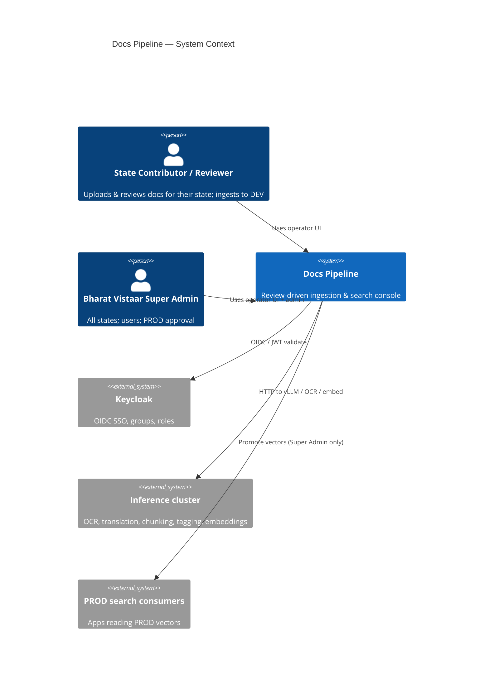
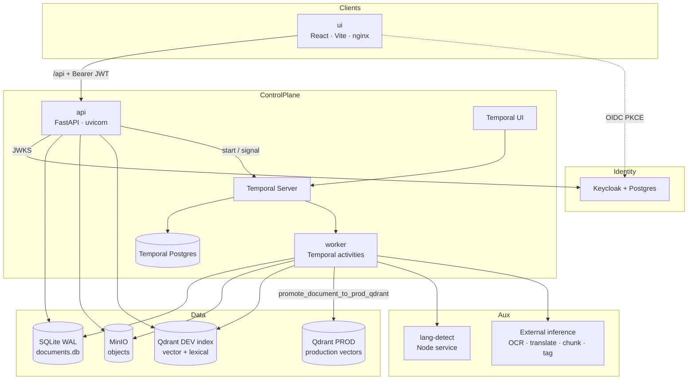
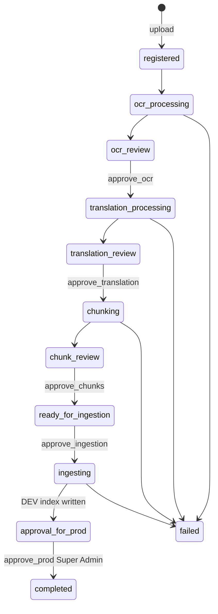
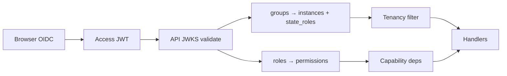
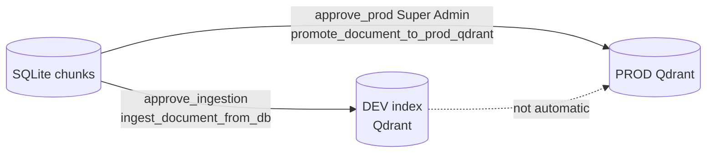

# System Design — Bharat Vistaar Docs Pipeline

**Status:** living design (matches current code)  
**Audience:** engineering, platform, security, ops  
**Related:**
- [architecture-pipeline-rbac.md](./architecture-pipeline-rbac.md) — roles, DEV/PROD gate, login flow  
- [system-design-diagram.png](./system-design-diagram.png) · [HTML](./system-design-diagram.html) — request/data flow  
- [architecture-diagram.png](./architecture-diagram.png) · [HTML](./architecture-diagram.html) — containers/deployment  
- [ENV.md](../ENV.md) — environment variables  

### Diagrams (box-and-arrow engineering views)

| Diagram | File | What it shows |
|---|---|---|
| **System design** | [system-design-diagram.png](./system-design-diagram.png) · [HTML](./system-design-diagram.html) | Components + **request/data flow** (who calls what) |
| **Architecture** | [architecture-diagram.png](./architecture-diagram.png) · [HTML](./architecture-diagram.html) | **Containers / deployment** (services, ports, volumes, external ML) |
| RBAC flow (product) | [architecture-pipeline-rbac.md](./architecture-pipeline-rbac.md) | Login → roles → DEV → Super Admin PROD |


---

## 1. Problem & goals

### Problem
State teams and Bharat Vistaar operators need a **review-driven** way to turn
policy / scheme / knowledge PDFs into **searchable, provenance-linked** text
chunks — with **state isolation**, controlled **DEV** publication, and a hard
gate before **PROD**.

### Goals

| Goal | How the design meets it |
|---|---|
| Multilingual document → searchable chunks | OCR → translate → chunk → embed → index |
| Human quality control | Temporal **signals** pause at OCR / translation / chunk / pre-ingest |
| Multi-state tenancy | `documents.instance` + JWT groups; lists/search scoped |
| DEV before PROD | Stage 9 writes DEV index; stage 10 waits; Super Admin promotes to PROD |
| Operability | Runs, queue, audit, reconcile, artifacts UI |
| Durable long work | Temporal retries + SQLite state mirror |

### Non-goals
- Real-time chat / low-latency LLM product surface  
- Being the CMS for content authoring beyond pipeline review  
- Bundling GPU model servers (OCR / vLLM / embeddings run as external deps)  

---

## 2. Context (C4 L1)



**Actors**

| Actor | Primary use |
|---|---|
| State Contributor | Upload, process, review, **ingest DEV** in assigned state(s) |
| State Reviewer | Review/approve stages in state; no upload |
| Super Admin (BV) | All states, settings, users, **Approve for Prod** |

---

## 3. Containers (C4 L2)



### Service catalog

| Container | Image / code | Responsibility | Default port |
|---|---|---|---|
| **ui** | `ui/` React SPA | Operator console; never talks to Temporal/Qdrant directly | 3000 |
| **api** | `pipeline/api.py` | Auth, commands, read models, search proxy, admin | 8001 |
| **worker** | `pipeline/worker.py` | Heavy activities; same image as API | — |
| **temporal** | official image | Workflow durability, signals, retries | 7233 |
| **minio** | official | Source PDF + stage artifacts | 9000 |
| **qdrant** | official image | DEV search index | 6333 |
| **qdrant (prod)** | external / env | PROD vectors after Super Admin promote | `PROD_QDRANT_URL` |
| **sqlite** | volume file | Canonical document/page/chunk/job/audit state | path |
| **keycloak** | official | Identity, groups `/states/{ST}/role`, `/global/super-admin` | 8082 |
| **lang-detect** | `lang-detect/` | Language hints before translation | internal |

API and worker share one **SQLite volume** and the same env for providers so
read and write paths stay consistent.

---

## 4. Logical architecture

```text
┌──────────────────────────────────────────────────────────────────────────┐
│                         PRESENTATION LAYER                               │
│  Login · Dashboard · Documents · Document Ops · Runs · Search · Users    │
│  Permission-aware UI  ·  instance badges  ·  stage stepper               │
└───────────────────────────────┬──────────────────────────────────────────┘
                                │ HTTPS / same-origin /api
┌───────────────────────────────▼──────────────────────────────────────────┐
│                         API / CONTROL LAYER                              │
│  JWT validation · tenancy · permissions · REST resources · audit write   │
│  Start/signal Temporal workflows · search orchestration                  │
└───────────────┬─────────────────────────────┬────────────────────────────┘
                │                             │
┌───────────────▼──────────────┐   ┌──────────▼────────────────────────────┐
│   ORCHESTRATION LAYER        │   │   DOMAIN STATE LAYER                  │
│   Temporal workflows         │   │   SQLite (SoT for content)            │
│   + review signals           │   │   MinIO (binaries)                    │
│   + activity retries         │   │   Jobs / audit / index status         │
└───────────────┬──────────────┘   └───────────────────────────────────────┘
                │
┌───────────────▼──────────────────────────────────────────────────────────┐
│                         PROCESSING LAYER (worker)                        │
│  OCR · language detect · translation · chunking · domain tags · embed    │
└───────────────┬─────────────────────────────┬────────────────────────────┘
                │                             │
┌───────────────▼──────────────┐   ┌──────────▼────────────────────────────┐
│  SEARCH DEV                  │   │  SEARCH PROD                          │
│  Qdrant DEV                  │   │  Qdrant PROD                          │
│  after approve_ingestion     │   │  after approve_prod (Super Admin)     │
└──────────────────────────────┘   └───────────────────────────────────────┘
```

---

## 5. Core use cases

### 5.1 State operator — upload to DEV

1. Login → Keycloak groups → JWT  
2. `GET /auth/me` → `instances`, `permissions`, `state_roles`  
3. Upload PDF with `instance` = allowed state  
4. Temporal `DocumentPipelineWorkflow` runs OCR → (reviews) → chunk →  
5. Operator **approve ingestion** → `ingest_document_from_db` → **DEV index**  
6. Stage becomes `approval_for_prod` — **state work complete**

### 5.2 Super Admin — promote to PROD

1. Super Admin sees all states’ documents in `approval_for_prod`  
2. Reviews pages/chunks (optional quality check)  
3. `POST /documents/{id}/approve-prod` (`RequireAdmin`)  
4. Signal `approve_prod` **or** `PromoteToProdWorkflow`  
5. `promote_document_to_prod_qdrant` → **PROD Qdrant**  
6. Stage `completed`; audit `promote_to_prod`

### 5.3 Search

- Operator search workbench hits API → Qdrant with optional  
  `instance` filter for non–super-admins.  
- PROD consumers read the **PROD** collection only after promotion.

---

## 6. Pipeline stage machine (system view)



| Band | Stages | Actor |
|---|---|---|
| State lane | 1 Registered → 9 Ingesting DEV | Contributor / Reviewer (+ SA) |
| Prod gate | 10 Approval for Prod → 11 Completed | **Super Admin only** |

Supporting workflows: `OcrOnly`, `TranslationOnly`, `ChunkingOnly`,
`Reingestion`, `PromoteToProd` — resume or re-drive without full re-run.

---

## 7. Data design

### 7.1 Stores & ownership

| Store | System of record for | Not for |
|---|---|---|
| **SQLite** | Document stage, pages, chunks, tags, jobs, audit, uploader, `instance` | Binary blobs |
| **MinIO** | PDF originals, exports, payloads | AuthZ decisions |
| **Temporal DB** | Workflow history & timers | Business content |
| **Qdrant DEV** | Searchable DEV vectors | Authoritative text |
| **Qdrant PROD** | Production vectors | Draft/unapproved content |

### 7.2 Key entities (SQLite)

```text
documents (workflow_id PK)
  ├── instance              # tenant / state code
  ├── stage                 # DocumentStage enum
  ├── uploaded_by_*         # actor provenance
  ├── page_count / chunk_count
  ├── latest_job_id
  ├── reindex_required
  └── is_disabled / is_demo

pages (workflow_id, page_number)
  └── OCR + translation fields + review flags

chunks (workflow_id, chunk_num)
  └── text, lineage, exclusion, provenance
  └── chunk_tags[]

document_jobs
  └── job_type, status, temporal ids  → Runs UI

audit_logs
  └── approvals, edits, promote_to_prod
```

### 7.3 Tenant rule
- `instance` set **once** at create (not reassigned on upsert).  
- Restricted users: `list_*` / get / search filtered by allowed instances.  
- Cross-tenant access → **404**.

---

## 8. AuthN / AuthZ design



| Product role | Keycloak | Permissions (summary) |
|---|---|---|
| `super_admin` | `/global/super-admin` | all incl. `admin`, `manage_users` |
| `contributor` | `/states/{ST}/contributor` | upload, review, pipeline, delete_own, search |
| `reviewer` | `/states/{ST}/reviewer` | review, search |

| Sensitive action | Permission | Who |
|---|---|---|
| Upload | `upload` | Contributor, Super Admin |
| Approve OCR/…/ingestion | `review` | State roles + SA |
| Re-run stages / reindex | `pipeline` | Contributor, Super Admin |
| **Approve PROD** | `admin` | **Super Admin only** |
| Users admin | `manage_users` | Super Admin only |

Code: `pipeline/auth/{jwt,groups,permissions,tenancy,deps}.py`.

---

## 9. API surface (logical groups)

| Group | Examples | Auth |
|---|---|---|
| Auth | `GET /auth/me` | Bearer |
| Documents | list, get, upload, disable, reconcile | tenancy + perms |
| Approvals | `approve-ocr`, `approve-translation`, `approve-chunks`, `approve-ingestion` | `review` |
| Prod | `POST .../approve-prod` | **`admin`** |
| Jobs / runs | `GET /runs`, `GET /runs/{id}` | tenancy + `search` |
| Search | Qdrant search proxy | tenancy filter |
| Admin users | Keycloak provision list | `manage_users` |
| Settings / indexes | platform config | `admin` |

UI always calls API via `/api` proxy — no direct Temporal/MinIO from browser.

---

## 10. Processing design (worker)

| Activity | Purpose | Failure handling |
|---|---|---|
| `run_ocr_and_store` | Extract pages → SQLite + MinIO | OCR_RETRY |
| `detect_and_translate_pages_from_db` | Lang detect + translate | TRANSLATION_RETRY |
| `create_chunks_from_db` | Chunk reviewed text | CHUNK_RETRY |
| `auto_tag_chunks_from_db` | Domain tags | CHUNK_RETRY |
| `ingest_document_from_db` | Embed + write **DEV** index | INGEST_RETRY |
| `promote_document_to_prod_qdrant` | Re-upsert to **PROD** | INGEST_RETRY |
| `update_document_state` | Mirror stage (local activity) | STATE_UPDATE_RETRY |

Providers are **config-driven** (env URLs/models) so OCR/vLLM backends can change without code forks.

---

## 11. DEV vs PROD indexing



| Environment | When written | Who triggers | Env knobs |
|---|---|---|---|
| DEV | After pre-ingestion approve | State or SA | `VECTOR_DB_URL` |
| PROD | After prod approve | **Super Admin only** | `PROD_VECTOR_DB_URL`, `PROD_VECTOR_DB_API_KEY`, collection name |

Prod promotion **never** auto-fires — workflow always waits on `prod_approved`.

---

## 12. Frontend design (brief)

| Concern | Approach |
|---|---|
| Auth | Keycloak JS adapter; silent SSO; Bearer on fetch |
| AuthZ UX | `hasPermission`, hide admin-only actions (`approve_prod` → `admin`) |
| Tenancy UX | Instance badges; filtered lists from API |
| Document ops | Stage stepper + review tabs (pages/chunks/jobs/audit) |
| Header | Title + Details sheet (uploader/state/role/ids) |

Routes: Dashboard, Documents, New Document, Document Ops, Runs, Search, Users (SA), Settings (SA).

---

## 13. Deployment topology

### Dev / single host (`docker-compose.yml`)
- All control-plane + Keycloak + MinIO + Qdrant + Temporal  
- Inference often on host GPUs (`host.docker.internal`)  
- Auth can run with `AUTH_DISABLED` for local bypass  

### Prod-ish (`docker-compose.prod.yml`)
- Bound to localhost ports behind reverse proxy  
- Secrets via env  
- UI/API/worker/temporal/minio; vector backends may be remote  

### Runtime properties
- API + worker: **same image**, different entrypoint  
- Shared SQLite volume (single-writer lock + WAL)  
- Horizontal scale: Temporal workers scale out; SQLite remains single-primary (acceptable for ops volume; upgrade path = Postgres if needed)

---

## 14. Cross-cutting concerns

| Concern | Design |
|---|---|
| **Consistency** | SQLite SoT; Temporal for execution; search is eventual projection |
| **Idempotency** | Workflow ids; reingest overwrites by document id |
| **Observability** | Runs UI, Temporal UI, audit_logs, stage mirror |
| **Security** | JWT, least privilege, tenant 404, Super Admin prod gate |
| **Reconciliation** | `reconcile` advances stage to match materialised pages/chunks |
| **Soft delete** | `is_disabled` hide from default lists |
| **Audit** | Approvals & promote carry actor email/roles |

---

## 15. Threat & trust boundaries

```text
[ Browser ] --JWT--> [ API ] --internal net--> [ Worker / Temporal / MinIO / SQLite ]
                           |
                           +--JWKS--> [ Keycloak ]
                           +--HTTP--> [ Qdrant DEV ]
[ Super Admin only ] ------> promote ----> [ Qdrant PROD ]
```

- Browser never holds MinIO keys or Temporal access.  
- Restricted tokens cannot list other states.  
- PROD write path requires `Permission.ADMIN`.  

---

## 16. Quality attributes (target)

| Attribute | Target approach |
|---|---|
| Availability | Compose restart policies; Temporal retries |
| Durability | Workflow history + SQLite + MinIO objects |
| Latency | Search interactive; OCR batch (minutes) |
| Isolation | Per-state `instance` + Keycloak groups |
| Auditability | append-only audit + Temporal history |
| Operability | Queue, Runs, reconcile, reindex flags |

---

## 17. Evolution / extension points

1. Explicit **“Request PROD approval”** action (today: auto-enter queue after DEV).  
2. SQLite → Postgres if multi-writer scale is needed.  
3. Stricter per-state role on every mutation (not only global permission).  
4. Automated quality checks before Super Admin sees queue.  

---

## 18. Document map

| Need | Doc |
|---|---|
| **System design** | `docs/SYSTEM_DESIGN.md` |
| **System design diagram** | `docs/system-design-diagram.png` (+ `.html`) |
| **Architecture diagram** | `docs/architecture-diagram.png` (+ `.html`) |
| RBAC + DEV/PROD story | `docs/architecture-pipeline-rbac.md` |
| Runbook / how to run | `README.md` |
| Env vars | `ENV.md` |

---

## 19. One-line summary

> **Keycloak-authenticated operators process state-scoped documents through a Temporal review pipeline into a DEV search index; only Bharat Vistaar Super Admin can promote approved content into PROD.**
