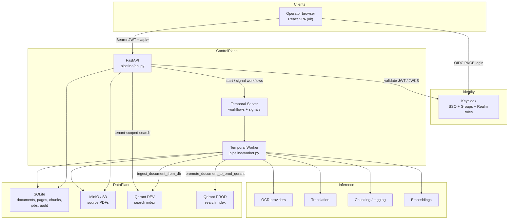
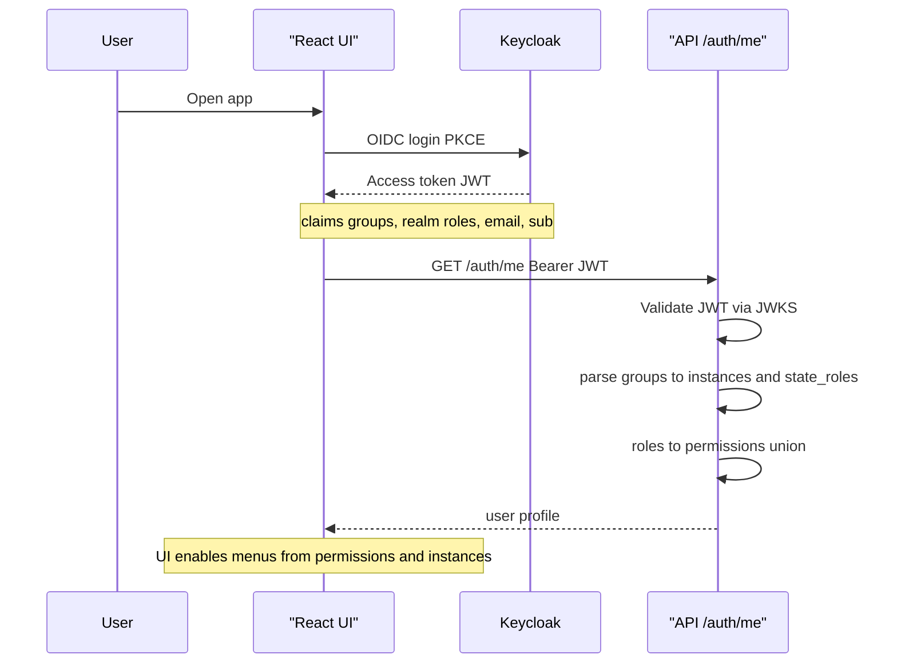
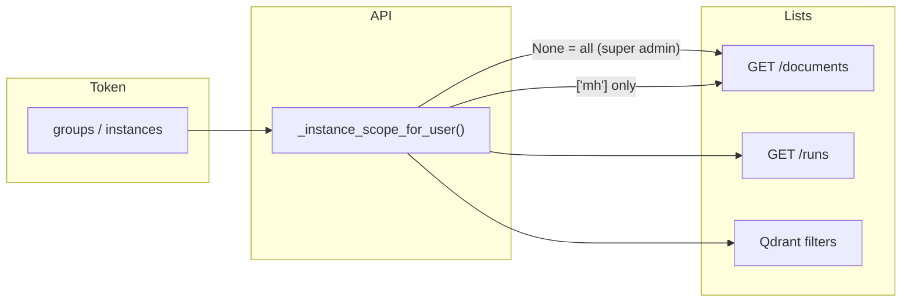
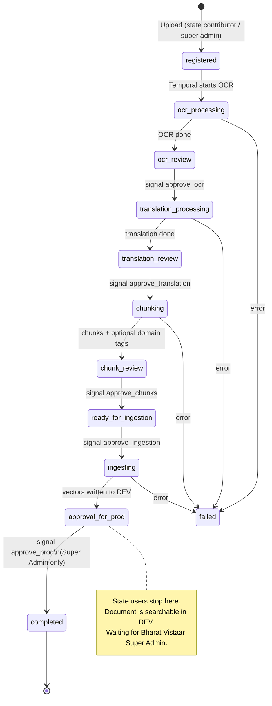
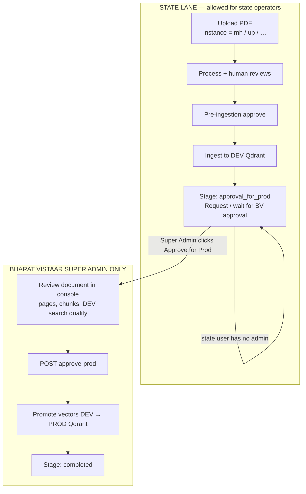
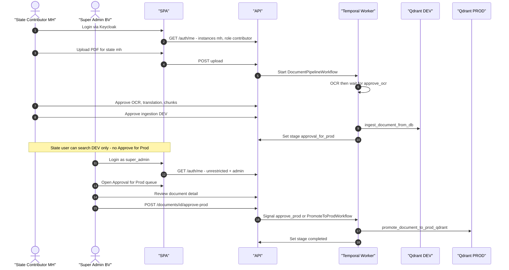
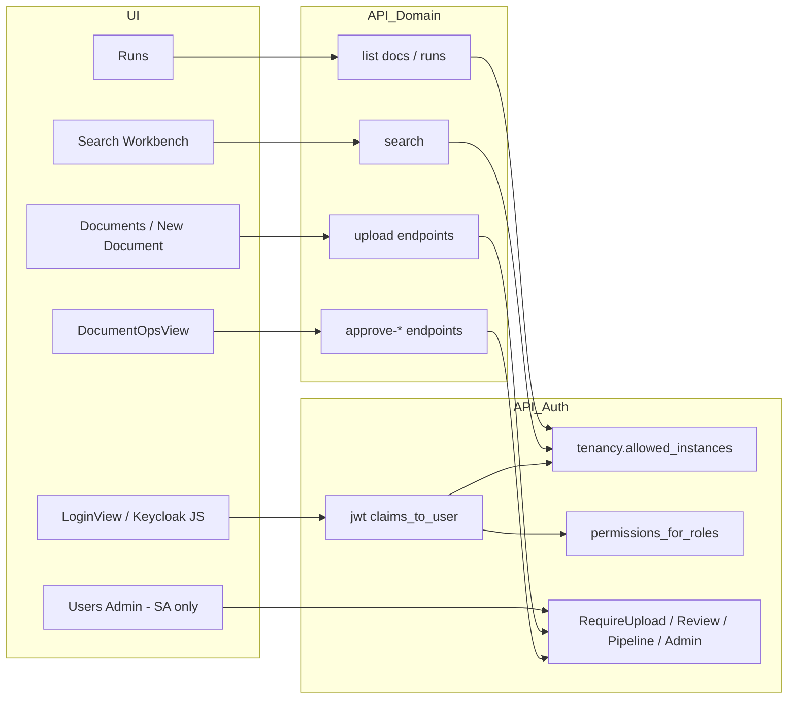
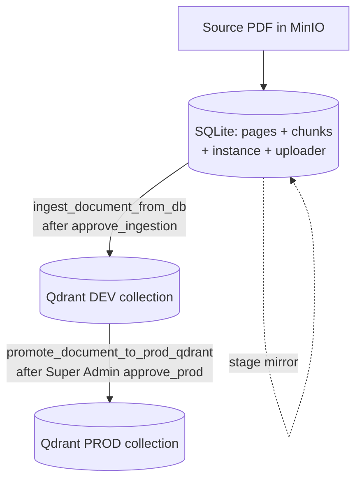

# Architecture — Login, Role-Based Access, Dev Ingest & Prod Approval

This document describes **how Bharat Vistaar Docs Pipeline works end-to-end**: from SSO login and state/role resolution, through document processing and **DEV** ingestion, to **PROD** promotion that only **Bharat Vistaar Super Admin** can approve.

Grounded in current code under `pipeline/`, `ui/`, and Keycloak group conventions.

**Also see:** [SYSTEM_DESIGN.md](./SYSTEM_DESIGN.md) for full system design, plus the box-and-arrow diagrams:

- [system-design-diagram.png](./system-design-diagram.png) · [HTML](./system-design-diagram.html)
- [architecture-diagram.png](./architecture-diagram.png) · [HTML](./architecture-diagram.html)

---

## 1. Goals (governance)

| Actor | Scope | What they may do | What they may **not** do |
|---|---|---|---|
| **State Contributor** | One or more states (`mh`, `up`, …) | Upload, process, review, **ingest to DEV** for their state | Promote to PROD; see other states |
| **State Reviewer** | Assigned state(s) | Review / approve stages within state | Upload, delete, promote to PROD |
| **Super Admin (Bharat Vistaar)** | All states + portal `bv` | Everything above **plus** user management, settings, **review & approve PROD** | — |

**Hard rule:** State operators may drive a document only as far as **Ingested in DEV** (`approval_for_prod` queue).  
**PROD vectors are written only after Super Admin approval.**

---

## 2. High-level system architecture



### Responsibilities

| Layer | Responsibility |
|---|---|
| **Keycloak** | Source of truth for *who* is Super Admin vs which **state + role** a user has |
| **JWT → API** | Map groups/roles → `permissions`, `instances`, `state_roles`; enforce tenancy + capability |
| **Temporal workflow** | Durable pipeline with human gates (signals) |
| **SQLite** | System of record for document stage, pages, chunks, uploader, `instance` |
| **Qdrant DEV** | Searchable vectors after state-approved ingestion |
| **Qdrant PROD** | Production vectors only after Super Admin `approve_prod` |

---

## 3. Login & role resolution (start of every session)



### Keycloak group model

```text
/global
  /super-admin                 → product role: super_admin (Bharat Vistaar)
/states
  /MH
    /contributor               → state mh + contributor
    /reviewer                  → state mh + reviewer
  /UP
    /contributor
    /reviewer
  …
```

### Token → app profile (example)

| Claim | App field | Meaning |
|---|---|---|
| `/global/super-admin` | `is_super_admin: true`, all instances | Platform operator |
| `/states/MH/contributor` | `instances: [mh]`, `state_roles.mh: contributor` | MH uploader/ops |
| `realm_access.roles` | `roles[]` → `permissions[]` | Capability bits |

### Product permissions

| Permission | Super Admin | State Contributor | State Reviewer |
|---|:---:|:---:|:---:|
| `search` | ✓ | ✓ | ✓ |
| `upload` | ✓ | ✓ | — |
| `review` | ✓ | ✓ (own/state policy) | ✓ |
| `pipeline` | ✓ | ✓ | — |
| `delete_own` | ✓ | ✓ | — |
| `admin` (**prod approve**, settings, hard delete) | ✓ | — | — |
| `manage_users` | ✓ | — | — |

Implementation: `pipeline/auth/permissions.py`, `pipeline/auth/groups.py`, `pipeline/auth/jwt.py`, `ui/src/auth/AuthProvider.jsx`.

---

## 4. Tenant isolation (state-level data boundary)

Every document is stamped with **`documents.instance`** at upload time (e.g. `mh`, `up`, or portal `bv`).



- **Super Admin:** unrestricted instance list (`None` scope).
- **State user:** only documents / runs / chunks / search hits for allowed states.
- Cross-tenant access returns **404** (not 403) to avoid leaking IDs.

---

## 5. End-to-end document pipeline (stages)

Human-in-the-loop stages use **Temporal signals**. Processing stages run activities on the worker.



### Stage ownership matrix

| Stage | Who advances it | Effect |
|---|---|---|
| Upload → Registered | Contributor / Super Admin (`upload`) | File in MinIO; SQLite row; `instance` set |
| OCR / Translation / Chunking | System (worker activities) | Pages/chunks in SQLite |
| OCR / Translation / Chunk / **Pre-ingestion** approve | State **review** (+ pipeline as needed) or Super Admin | Temporal signal continues workflow |
| **Ingesting in Dev** | System after `approve_ingestion` | `ingest_document_from_db` → **Qdrant DEV** |
| **Approval for Prod** (queue) | Document waits | Still **DEV-only** in search until promote |
| **Approve for Prod** | **Super Admin only** (`admin` / `RequireAdmin`) | `promote_document_to_prod_qdrant` → **Qdrant PROD** → `completed` |

Signals (workflow): `approve_ocr`, `approve_translation`, `approve_chunks`, `approve_ingestion`, `approve_prod` — see `pipeline/workflows.py`.

API (examples):

- `POST /documents/{id}/approve-ocr` … `approve-ingestion` → state-capable roles with `review`
- `POST /documents/{id}/approve-prod` → **`RequireAdmin`** (Super Admin)

UI gates: `DocumentOpsView` maps `approve_prod` → permission `admin`; other approvals → `review`.

---

## 6. Dev vs Prod data path (critical split)



### What “request for approval” means operationally

| Step | State user | Super Admin |
|---|---|---|
| Finish DEV ingest | Workflow auto-moves stage to `approval_for_prod` | Same |
| Express readiness for prod | Document sits in **Approval for Prod** queue / Runs / Dashboard (state-scoped list) | Sees **all states** in queue |
| Promote | **No** `Approve for Prod` button (`admin` missing) | Reviews content → **Approve for Prod** |
| Result | Still only DEV-indexed until SA acts | PROD index updated; stage `completed` |

> **Implementation note:** There is no separate “request approval” API today. Completing DEV ingest **is** the request: the document enters the Super Admin queue at `approval_for_prod`. Prod promotion never runs on `auto_approve`; the workflow always waits for `prod_approved` (`workflows.py`).

---

## 7. Swimlane: full journey (login → prod)



---

## 8. Component architecture (runtime)



---

## 9. Storage & promotion detail



- **DEV ingest** activity: `ingest_document_from_db` (worker).
- **PROD promote** activity: `promote_document_to_prod_qdrant` (requires `PROD_QDRANT_URL`).
- Chunk payloads include **`instance`** for tenant-filtered search.

---

## 10. UI capability map (what each role sees)

| Console area | State Contributor | State Reviewer | Super Admin |
|---|---|---|---|
| Login / profile | Own states + role | Own states + role | All states · Super Admin |
| Upload new document | Yes (own state) | No | Yes (any / portal) |
| Documents / Runs lists | Own state only | Own state only | All states |
| OCR → Chunk reviews | Yes | Yes | Yes |
| Approve ingestion (**DEV**) | Yes | Yes (if review) | Yes |
| **Approve for Prod** | Hidden / denied | Hidden / denied | **Yes** |
| Users admin | No | No | Yes |
| Platform settings | No | No | Yes |

---

## 11. Security summary

1. **Authentication:** Keycloak OIDC; API validates JWT (JWKS).
2. **Authorization (capability):** permission bits from product roles.
3. **Authorization (tenant):** `instance` on every document; list/get/search scoped.
4. **Authorization (prod):** `approve_prod` bound to `Permission.ADMIN` → Super Admin only.
5. **Audit:** approval and promote actions logged with actor identity/roles.

---

## 12. Reference file map

| Concern | Location |
|---|---|
| Stages enum | `pipeline/models.py` → `DocumentStage` |
| Workflow + signals | `pipeline/workflows.py` |
| DEV ingest / PROD promote activities | `pipeline/activities.py` |
| Approve prod API | `pipeline/api.py` → `POST .../approve-prod` |
| Permissions | `pipeline/auth/permissions.py` |
| Groups / super_admin | `pipeline/auth/groups.py` |
| Tenancy | `pipeline/auth/tenancy.py` |
| Keycloak groups / roles | this doc §3 + `keycloak/import/` |
| UI action → permission | `ui/src/views/DocumentOpsView.jsx` (`ACTION_PERMISSION`) |
| Role catalog UI | `ui/src/lib/roleCapabilities.js` |

---

## 13. One-page story

```text
  Login (Keycloak)
        │
        ▼
  Resolve role + states ──► Super Admin? ──yes──► full platform
        │                         │
        │ no                      │
        ▼                         │
  State operator (MH / UP / …)    │
        │                         │
        ▼                         │
  Upload → OCR → Translate → Chunk │
  (reviews at each gate)          │
        │                         │
        ▼                         │
  Approve ingestion ──────────────┼──► Write vectors to Qdrant DEV
        │                         │
        ▼                         │
  Stage = approval_for_prod       │
  (state work complete)           │
        │                         │
        └──── Super Admin review ─┘
                    │
                    ▼
           Approve for Prod
                    │
                    ▼
           Promote DEV → PROD
                    │
                    ▼
              Stage = completed
```

**State lane ends at DEV. Bharat Vistaar Super Admin alone opens the gate to PROD.**
